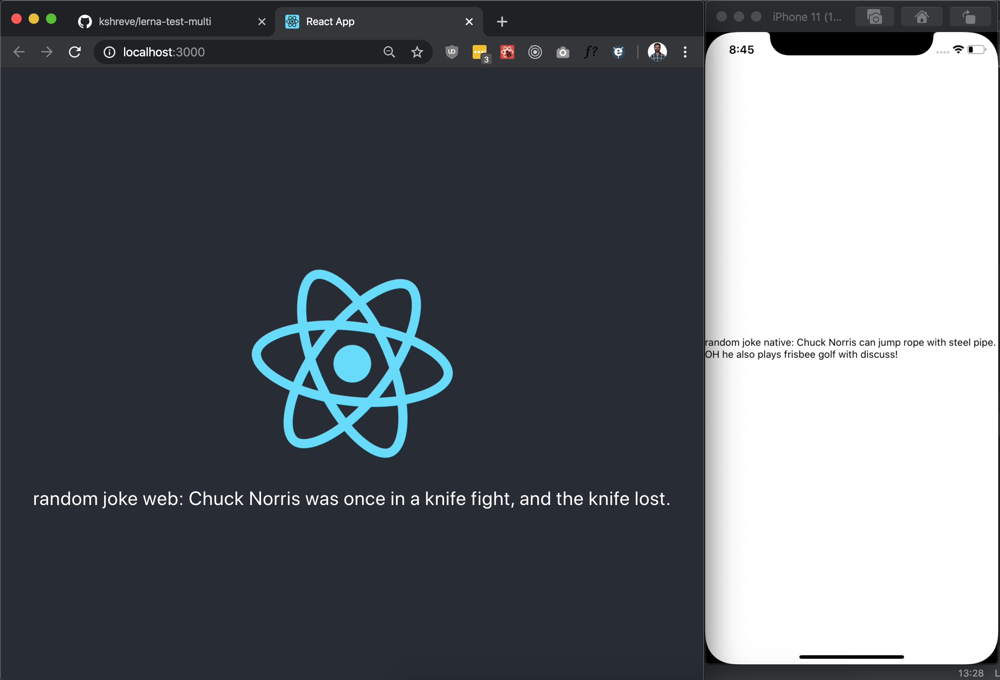
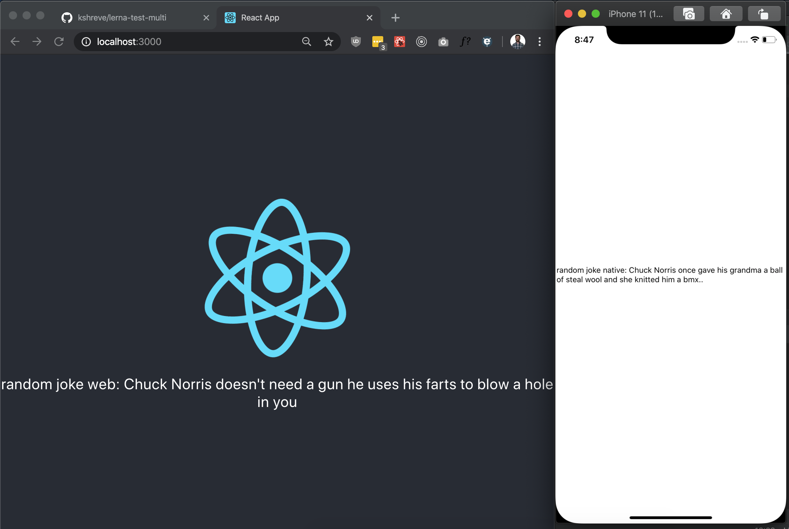

# lerna-test-multi
A Test project to show how to share redux logic across platforms and projects

## How to run
1. clone
2. cd lerna-test-multi
3. yarn
4. yarn bootstrap
5. a. yarn web-start  b. yarn native-start

## packages
/packages/web => create-react-app setup

/packages/native => create-react-native-app setup
##
/packages/lerna-test-multi-redux => shared redux setup for both

## images

//

